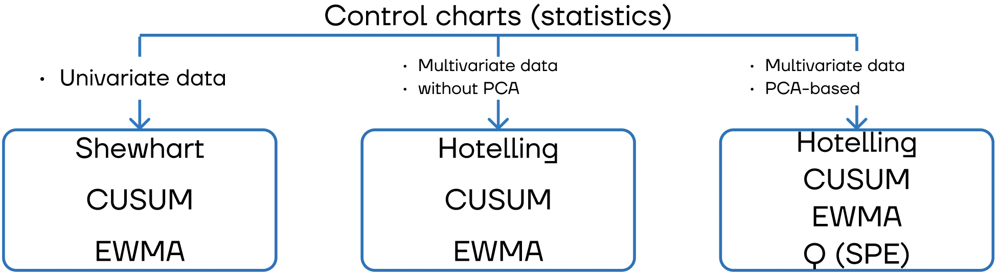

[](https://github.com/waico/arimafd/blob/master/LICENSE.txt)

# About control charts
A lot of useful information one can find in the book "Introduction to Statistical Quality Control" by DOUGLAS C. MONTGOMERY.


# About ControlCharts package
We provide python implementation of the control charts used for process monitoring and anomaly detection.

# Control charts
### (tba) Univariate Shewhart statistic

### Multivariate Hotelling's T-squared statistic 
Hotelling's statistic is one of the most popular statistical process control techniques. It is based on the Mahalanobis distance.
Generally, it measures the distance between the new vector of values and the previously defined vector of normal values additionally using variances.

[[paper]](https://www.semanticscholar.org/paper/Multivariate-Quality-Control-illustrated-by-the-air-Hotelling/529ba6c1a80b684d2f704a7565da305bb84f14e8)

### Multivariate Hotelling's T-squared statistic + Q statistic (SPE index) based on PCA
The combined index is based on PCA.
Hotelling’s T-squared statistic measures variations in the principal component subspace.
Q statistic measures the projection of the sample vector on the residual subspace.
To avoid using two separated indicators (Hotelling's T-squared and Q statistics) for the process monitoring, we use a combined one based on logical or.

[[paper]](https://analyticalsciencejournals.onlinelibrary.wiley.com/doi/abs/10.1002/cem.800)

### (tba) Univariate and multivariate EWMA statistics

### (tba) Univariate and multivariate CUSUM statistics

# Examples
Examples of using control charts for anomaly detection are available in the [examples](examples/) folder.

# License
MIT

# Citation
Please cite our project in your publications if it helps your research.
```
Iurii D. Katser and Vyacheslav O. Kozitsin, “Skoltech Anomaly Benchmark (SKAB).” Kaggle, 2020, doi: 10.34740/KAGGLE/DSV/1693952.
```
Or in BibTeX format:
```
@misc{skab,
  author = {Katser, Iurii D. and Kozitsin, Vyacheslav O.},
  title = {Skoltech Anomaly Benchmark (SKAB)},
  year = {2020},
  publisher = {Kaggle},
  howpublished = {\url{https://www.kaggle.com/dsv/1693952}},
  DOI = {10.34740/KAGGLE/DSV/1693952}
}
```