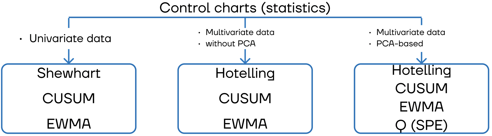

[](https://github.com/YKatser/ControlCharts/blob/main/LICENSE)

# About control charts
Control charts solve univariate and multivariate quality-control (or process-monitoring) problems.

This package is about the use of statistical methods and other problem-solving techniques to improve the quality of the products used by our society. These products consist of manufactured goods such as automobiles, computers, and clothing, as well as services such as the generation and distribution of electrical energy, public transportation, banking, retailing, and health care. Quality improvement methods can be applied to any area within a company or organization, including manufacturing, process development, engineering design, finance and accounting, marketing, distribution and logistics, customer service, and field service of products.

The taxonomy of existing control charts:


More useful information one can find in the book "Introduction to Statistical Quality Control" by Douglas C. Montgomery.

# Documentation
The documetation is available at [https://ControlCharts.readthedocs.io/](https://ControlCharts.readthedocs.io/)

# Control charts
1. (tba) Univariate Shewhart statistic

2. Multivariate Hotelling's T-squared statistic [[paper]](https://www.semanticscholar.org/paper/Multivariate-Quality-Control-illustrated-by-the-air-Hotelling/529ba6c1a80b684d2f704a7565da305bb84f14e8)  
Hotelling's statistic is one of the most popular statistical process control techniques. It is based on the Mahalanobis distance.
Generally, it measures the distance between the new vector of values and the previously defined vector of normal values additionally using variances.

3. Multivariate Hotelling's T-squared statistic + Q statistic (SPE index) based on PCA 
[[paper]](https://analyticalsciencejournals.onlinelibrary.wiley.com/doi/abs/10.1002/cem.800)  
The combined index is based on PCA.
Hotelling’s T-squared statistic measures variations in the principal component subspace.
Q statistic measures the projection of the sample vector on the residual subspace.
To avoid using two separated indicators (Hotelling's T-squared and Q statistics) for the process monitoring, we use a combined one based on logical or.

4. (tba) Univariate and multivariate EWMA statistics

5. (tba) Univariate and multivariate CUSUM statistics

# License
MIT

# Citation
Please cite our project in your publications if it helps your research.
```
Iurii D. Katser and Vyacheslav O. Kozitsin, “Skoltech Anomaly Benchmark (SKAB).” Kaggle, 2020, doi: 10.34740/KAGGLE/DSV/1693952.
```
Or in BibTeX format:
```
@misc{skab,
  author = {Katser, Iurii D. and Kozitsin, Vyacheslav O.},
  title = {Skoltech Anomaly Benchmark (SKAB)},
  year = {2020},
  publisher = {Kaggle},
  howpublished = {\url{https://www.kaggle.com/dsv/1693952}},
  DOI = {10.34740/KAGGLE/DSV/1693952}
}
```